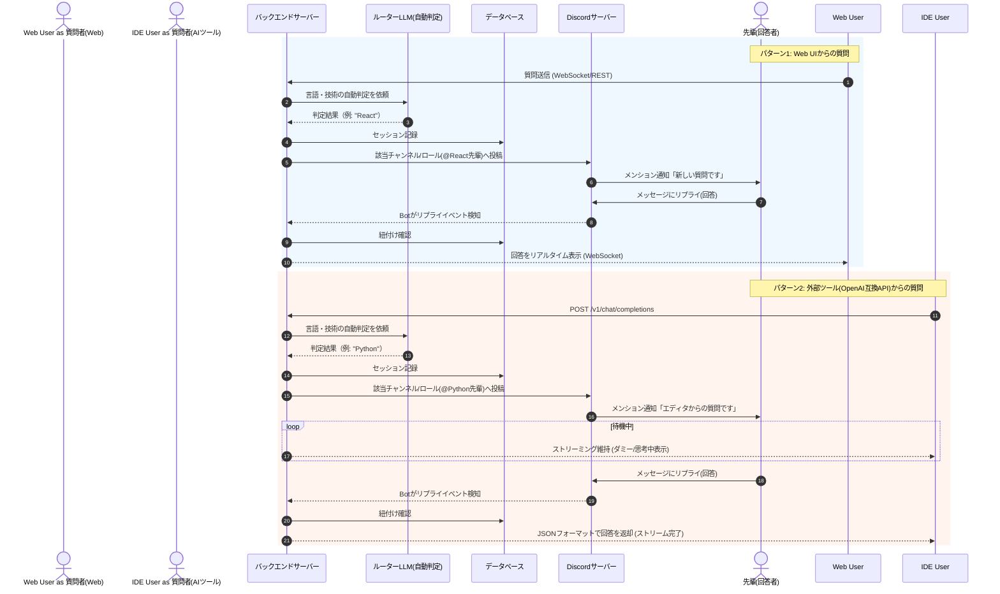

# 先輩質問システム（Human as LLM） 要件定義書・アーキテクチャ設計

## 1. システム概要
プログラミング初心者がWeb画面から、または開発者が使い慣れたAIエディタ（Codex, Cursor等）から、技術が得意な先輩に対して直接質問できるシステム。
裏側ではLLMではなく「人間の先輩」がDiscordを通じて回答を行うが、システム側がそれを隠蔽・仲介することで、**「先輩をあたかも1つのLLMモデルのように呼び出して利用できる」**という画期的な体験を提供する。

## 2. ターゲットユーザー
- **質問者（ユーザー）**:
  - 【Web UI利用】: 直接先輩に質問するのが億劫なプログラミング初心者。
  - 【外部ツール利用】: AIコーディング支援ツールに「先輩モデル」を組み込み、エディタ上からシームレスに人間に質問を投げたい開発者。
- **回答者（先輩）**:
  - 使い慣れたDiscordから一歩も出ることなく、後輩からの質問にリプライで回答する部員・エンジニア。

---

## 3. 主要機能要件（要件定義）

### 3.1 質問受付インターフェース（2つの入り口）
- **① Web UI機能（初心者向け）**
  - チャット形式で直感的に質問を入力できる画面。
  - バックエンドとWebSocket等で接続し、先輩からの返信をページ更新なしでリアルタイムに表示する。
- **② OpenAI互換 API機能（ツール向け）**
  - AIツールがLLMにアクセスするための標準的な規格（`POST /v1/chat/completions` 等）をエミュレートするエンドポイント。
  - ツールからのプロンプト（質問やコード）を受け取る。
  - **ストリーミング応答（Server-Sent Events）:** 人間の回答はLLMより時間がかかるため、HTTP通信がタイムアウトしないよう、接続を維持する仕組み（ダミーパケットの送信やステータス通知など）を実装する。

### 3.2 回答者側インターフェース（Discord連携）
- **質問の受信**
  - バックエンドが受け取った質問（Webから、またはツールから）を、先輩用のDiscordチャンネルにBot経由で送信する。
- **回答の送信**
  - 先輩がDiscord上でそのメッセージに対して「リプライ」を行うと、Botがそれを検知。
  - 回答内容を元のリクエスト元（Web UIまたは待機中のAPI）へルーティングして返却する。

### 3.3 データベース・状態管理
- 各質問リクエストの「セッションID」「リクエスト元（Web or API）」「DiscordのメッセージID」を紐付けて管理する機能。

### 3.4 質問の自動ルーティング機能（LLM案内係）
- 質問が送信された際、バックエンドで軽量・高速なLLM（Gemini Flash等）を用いて、質問の対象となるプログラミング言語やフレームワークを自動判定する。
- 判定結果に基づき、Discord上の該当カテゴリのチャンネルへ送信するか、対応する「先輩ロール（例: `@React先輩`）」にメンションを付けて通知する。
- ユーザー自身が言語を選択する手間を省き、シームレスに専門の先輩に質問を届けることができる。

---

## 4. システムアーキテクチャ・技術スタック構成

### 4.1 推奨技術スタック
フルスタックをTypeScript（Node.js環境）で統一し、開発効率とリアルタイム通信の親和性を高める。

*   **フロントエンド (Web UI)**: Next.js (React) またはプレーンなReact
*   **バックエンド (コアAPI & Bot)**: Node.js + Hono
*   **Discord連携**: discord.js
*   **リアルタイム通信**: Socket.io (Web UI用) / Server-Sent Events (APIのストリーミング応答用)
*   **データベース**: PostgreSQL + Prisma (ORM)

### 4.2 アーキテクチャ図（データフロー）

---

## 5. ユースケースシナリオ

### シナリオA: AIエディタ（Cursor等）からの利用
1. ユーザーがCursorのエディタ上でコードを選択し、チャット欄（モデルは「カスタム(先輩)」を選択）で「ここをリファクタリングして」と入力。
2. バックエンドがOpenAI互換APIとしてリクエストを受け取る。
3. 先輩のDiscordに「ここをリファクタリングして」というメッセージと該当コードが届く。
4. 先輩がコードを読み、Discord上で修正案のコードをリプライする。
5. ユーザーのCursor上に、先輩が書いた修正案が（まるでAIが生成したかのように）表示され、エディタに直接適用できる。

### シナリオB: Web UIからの利用
1. 初心者がWebサイトにアクセスし、「npm installでエラーが出ます」と送信。
2. 先輩のDiscordにメッセージが届く。
3. ユーザーの画面は「先輩が確認中...」と表示される。
4. 先輩が「エラーのログを貼ってみて！」と返信。
5. ユーザーの画面に即座に「エラーのログを貼ってみて！」と表示され、会話が継続する。
