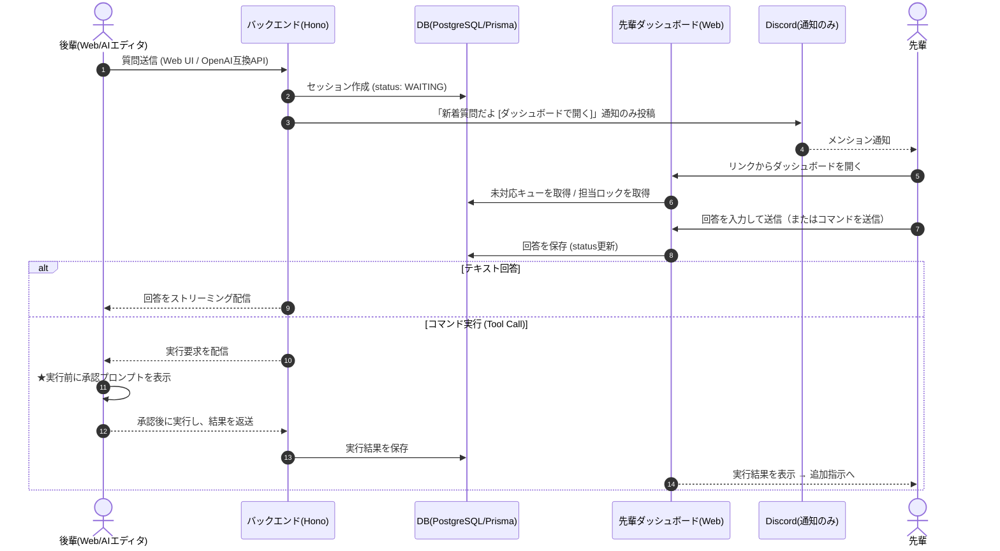

# 先輩質問システム（Human as LLM） 要件定義書・アーキテクチャ設計 v2.1

> **v2.1 の位置づけ**
> 初版（v1）から、運用スコープの明確化・先輩用回答UIの刷新・安全設計の追加を行った改訂版（v2）に、**認証・認可（Discordログインによる部員判定）**を追加した版です。
> 旧版の全文は Git 履歴（このファイルの過去コミット）に残っています。

## 変更履歴

| Ver | 主な変更点 |
|-----|-----------|
| v1  | 初版。Web UI / OpenAI互換API から質問を受け、Discord のスレッドで先輩が回答する構成を定義。 |
| **v2** | ①**スコープを「部活動内 × 活動時間中」に限定**。②回答UIを **先輩用Webダッシュボード**に刷新し、Discord は**通知チャネル**に降格（ハイブリッド構成）。③**コマンド実行の承認フロー**を安全要件として追加。④**Q&Aデータの資産化**を明示的な目的に追加。 |
| **v2.1** | **認証・認可を新設（§5.7）**。ログインを**Discord OAuth2**に一本化し、**特定Discordサーバー（ギルド）への所属**で部員判定。ギルド内ロール `@基礎班`＝後輩 / `@発展班`＝先輩 で利用可能な画面を区別。 |

---

## 1. コンセプト

これは単なるQ&Aツールではなく、**「人に質問する心理的ハードルを消すツール」**である。

プログラミング初心者が詰まる本当の理由は、技術そのものより「こんな初歩的なことを聞いていいのか」という遠慮にある。裏側の回答者が人間であっても、ユーザーからは **LLMを呼び出しているように見える**ことで、この心理的な壁を取り除く。

- **これは「AIの代わり」ではない。**「人に聞けない人のためのツール」である。
- LLMには出せない「**この環境・このコードベース・この部活固有**」の正確な回答（暗黙知）を届けられることが本質的な価値。
- そのやり取りは同時に、将来の資産となる **Q&Aデータ**として蓄積される（"Human as LLM" は、本物のLLMを育てるための訓練データ収集装置にもなる）。

---

## 2. 運用スコープと前提（v2で確定）

本システムは汎用SaaSではなく、**クローズドな部活動向けの内部ツール**として設計・運用する。

- **対象ユーザー**: 部活動のメンバー内のみ（部外非公開）。
- **稼働時間**: 原則、**部活動の活動時間中のみ**。先輩が在席している時間帯に限定して運用する。
- **リアルタイム回答が成立する前提**: 全員が同時間帯にオンライン／同席しているため、先輩の即時回答が現実的に可能。
- **非目標（やらないこと）**:
  - 24時間365日の対応、部外一般公開、SaaS化。
  - 不特定多数からの大量並列アクセスへのスケール。
  - これらを追わないことで、v1で課題だった「先輩の燃え尽き」「スケール破綻」を構造的に回避する。

---

## 3. 登場人物

| 役割 | 呼称 | 主な利用インターフェース |
|------|------|--------------------------|
| 質問者 | 後輩（ユーザー） | ① Web UI（初心者向けチャット）② AIエディタの OpenAI互換API（Cursor/Copilot等） |
| 回答者 | 先輩 | **先輩用Webダッシュボード（主）** ＋ Discord通知（副） |

> **役割とDiscordロールの対応**（詳細は §5.7）: 後輩 = ギルド内ロール `@基礎班` / 先輩 = ギルド内ロール `@発展班`。いずれもログインは共通のDiscordアカウントで行う。

---

## 4. アーキテクチャ全体像（ハイブリッド構成）

**回答は先輩用Webダッシュボードで行い、Discord は「新着通知」に専念する。**
これにより、Discordの通知力を活かしつつ、回答の正確さ・安全性・重複防止を自前UIで完全に制御する。

---

## 5. 機能要件

### 5.1 質問受付インターフェース（後輩側）※v1から継続・実装済み

- **① Web UI（初心者向け）**: チャット形式で質問を入力。先輩の返信をページ更新なしでリアルタイム表示（WebSocket または SSE）。
- **② OpenAI互換 API（AIエディタ向け）**: `POST /v1/chat/completions` をエミュレート。人間の回答は時間がかかるため、**SSEでKeep-Aliveチャンクを送りHTTPタイムアウトを防止**する（実装済み: 2秒間隔ポーリング／最大5分待機）。

### 5.2 回答インターフェース（先輩側）※v2で刷新

先輩の回答は、専用の **Webダッシュボード**を主とする。Discordは通知のみ。

- **質問キュー**: セッションを「未対応 / 対応中 / 完了」で一覧表示。リアルタイムに更新。
- **担当ロック**: どの先輩がどの質問を対応中かを可視化し、**複数人の重複回答を防ぐ**。
- **回答フォーム**: テキスト回答・コードブロックをその場で入力し送信。送信すると自動で正しい後輩へルーティングされる（v1のDiscord運用で必要だった「必ずスレッド内で発言」という**ヒューマンエラーを構造的に排除**）。
- **会話履歴表示**: 該当セッションのやり取り（後輩の質問・過去の回答・コマンド実行結果）を時系列で表示。
- **（任意）LLM下書き支援**: 軽量LLMが回答の下書きを生成し、先輩は「承認 or 修正」だけで済ませられる。先輩の負担を大きく下げる。
- **（任意）過去Q&A参照**: 蓄積された過去の類似Q&Aを参照できる。

### 5.3 Discord連携（通知チャネルへ降格）※v2で変更

- 新規質問が来たら、Discordの対象チャンネル（または該当先輩ロールへメンション）に、**「新着質問 ＋ ダッシュボードへのリンク」だけ**を投稿する。
- v1にあった「Discordスレッド内リプライを回答として検知する」経路は、ダッシュボードへの移行に伴い**段階的に縮小／廃止**する（移行期は両対応も可）。

### 5.4 コマンド実行の安全設計（RCE対策）※v2で新設・必須

先輩が後輩のシェルでコマンドを実行させられる機能は強力だが、**信頼された環境でも「後輩PC上の任意コード実行（RCE）」というリスク**を持つ。以下を必須要件とする。

- **後輩側の実行前承認**: 先輩からのコマンドは、後輩の画面／エディタで**実行前に必ず承認プロンプト**を表示し、後輩が承認するまで実行しない。
- **危険コマンドの警告**: 破壊的な操作（削除・権限変更・外部送信 等）を検知した場合は強調表示して警告する。
- **実行ログの保存**: 実行したコマンドと結果を Message（role=TOOL）として保存し、監査可能にする。

### 5.5 自動ルーティング（LLM案内係）※将来

- 質問内容から言語・フレームワークを軽量LLM（Gemini Flash等）で自動判定し、該当カテゴリ／該当先輩ロールへ振り分ける。ユーザーの言語選択の手間を省く。

### 5.6 Q&Aデータの資産化 ※v2で新設

- 質問・回答・コマンド・結果のペアを構造化して蓄積する（既存の Session / Message モデルを活用）。
- 部活の暗黙知を形式知化し、将来的には本物のLLMのファインチューニング用データセットとして活用できる形で保持する。

### 5.7 認証・認可（部員判定）※v2.1で新設

本システムはクローズドな部内ツール（§2）であり、**部員のみが利用できること**を認証で担保する。独自のパスワード管理は持たず、**Discordアカウントを唯一の認証基盤**とする。

- **ログイン方式**: **Discord OAuth2 のみ**。後輩・先輩の区別なく、全ユーザーがDiscordアカウントでログインする。パスワードやメールアドレスは自前で保持しない。
- **部員判定（認証 / Authentication）**: 部活の**特定のDiscordサーバーに所属しているか否か**で判定する。所属していないユーザーはログイン自体を拒否し、部外者を構造的に排除する。
- **役割判定（認可 / Authorization）**: 当該ギルド内の**ロール**で後輩／先輩を区別する。
  - `@基礎班` → **後輩**（質問側・Web UI / OpenAI互換APIを利用可）
  - `@発展班` → **先輩**（回答側・ダッシュボードを利用可）
  - 両ロールを保持する場合は**先輩（発展班）を優先**し、ダッシュボードへのアクセスを許可する。
  - いずれのロールも持たない部員（ギルド所属だが未割り当て）は、暫定的に**後輩相当の最小権限**とする（運用でロール付与を促す）。
- **判定の実現方式**: 既にBotが対象ギルドへ常駐しているため、以下を推奨する。
  - OAuthで要求するスコープは **`identify` のみ**に留め、ユーザーからはDiscordユーザーIDの取得だけに同意してもらう（同意範囲を最小化）。
  - ギルド所属可否とロールは、**Bot（Botトークン）が Discord API で対象ギルドのメンバー情報を照会**して判定する（`GuildMember.roles`）。ユーザーへ `guilds` / `guilds.members.read` の広いスコープを要求せずに済み、判定が確実。
  - ※代替案として OAuth の `guilds.members.read` スコープでクライアント側から取得する方式もあるが、上記Bot照会方式を主とする。
- **認可の適用点**:
  - **ダッシュボード配下のAPI**（キュー取得・担当ロック・回答送信・コマンド送信）は**発展班のみ**許可。
  - **質問受付API**（Web UI / OpenAI互換API）は**基礎班・発展班いずれも**許可（＝部員全員）。
- **セッション管理**: ログイン成功後、サーバー側でセッション（Cookieセッション or JWT）を発行する。役割（基礎班/発展班）はログイン時点のスナップショットとして保持し、**ロール変更（例: 基礎班→発展班への昇格）は再ログインまたは定期的な再照会で反映**する。
- **監査・紐付け**: 質問セッションには質問者のDiscordユーザーID、対応した先輩のDiscordユーザーIDを記録する（§7 の `assigneeId` 提案と整合）。誰が質問し誰が回答したかを追跡可能にする。

---

## 6. 技術スタック（実装状況を反映）

| 領域 | 採用技術 | 状況 |
|------|----------|------|
| バックエンド（コアAPI & Bot） | Node.js + Hono | 実装済み |
| Discord連携 | discord.js | 実装済み（通知役へ移行予定） |
| OpenAI互換API + ストリーミング | Hono `streamSSE` | 実装済み（DBポーリング方式） |
| データベース | PostgreSQL + Prisma | スキーマ実装済み |
| フロントエンド（後輩用Web UI） | Next.js (React) | 雛形のみ |
| **フロントエンド（先輩用ダッシュボード）** | Next.js (React) | **未着手（v2の主要開発対象）** |
| リアルタイム通信 | SSE（API用）/ WebSocket or SSE（Web UI・ダッシュボード用） | 一部実装済み |
| **認証・認可** | **Discord OAuth2（`identify`）＋ Bot によるギルド所属・ロール照会** | **未着手（v2.1で新設。§5.7）** |
| デザイン | `ui/web_llm_ui.pen`（Pencil） | 作成中 |

---

## 7. データモデル（現状 + v2追加提案）

### 現状（実装済み）

- **Session**: `id` / `source(WEB|API)` / `discordThreadId` / `status(OPEN|WAITING|EXECUTING|COMPLETED|ERROR)` / タイムスタンプ / `messages[]`
- **Message**: `id` / `sessionId` / `role(USER|ASSISTANT|TOOL)` / `content` / `toolCallId` / `commandName` / `discordMessageId` / `createdAt`

### v2で追加を提案するフィールド

- **Session**:
  - `assigneeId` / `assigneeName`（担当先輩。担当ロック用。DiscordユーザーIDを想定）
  - `requesterId`（質問者のDiscordユーザーID。§5.7の監査・紐付け用）
  - `title` または要約（キュー一覧の見出し用）
  - `topic`（自動ルーティングで判定した言語・技術）
- **Message**:
  - コマンド承認状態（例: `approvalStatus: PENDING | APPROVED | REJECTED`）
- **User（新規モデル / 認証用。§5.7）**:
  - `discordUserId`（主キー相当。Discordの一意ID）/ `displayName` / `avatarUrl`
  - `role`（`KISO`＝基礎班＝後輩 / `HATTEN`＝発展班＝先輩。ログイン時にギルドロールから判定・更新）
  - `lastLoginAt`（ロール再判定のタイミング管理用）
  - ※パスワード等の秘匿情報は保持しない（認証はDiscordに委譲）。

---

## 8. 画面設計（先輩ダッシュボード）

`ui/web_llm_ui.pen` のトーン＆マナーに揃える。主要ビュー:

1. **キュー画面**: 未対応質問のカード一覧（新着順）。カードに要約・言語・経過時間・担当状況を表示。
2. **回答画面**: 選択したセッションの会話履歴 ＋ 回答入力欄 ＋ コマンド送信 ＋ （任意）LLM下書きボタン。
3. **完了/履歴画面**: 解決済みQ&Aの閲覧・検索（データ資産の活用）。

---

## 9. 段階的実装計画（GitHub Issue に対応）

v2の開発は以下の単位で進める（詳細は各Issueを参照）。

0. **認証・認可基盤（Discordログイン ＋ 部員/ロール判定）**（§5.7。ダッシュボード・質問受付の前提となるため優先度高）
1. データモデル拡張（担当ロック・コマンド承認状態・Userモデル）
2. 先輩ダッシュボード: 質問キュー画面（リアルタイム一覧）
3. 先輩ダッシュボード: 回答フォーム & ルーティング
4. 先輩ダッシュボード: 担当ロック（重複回答防止）
5. コマンド実行の後輩側承認フロー（安全設計・必須）
6. Discord連携をハイブリッド通知へ移行
7. （任意）LLM下書き支援
8. （任意）過去Q&A参照 & データ資産化ビュー
